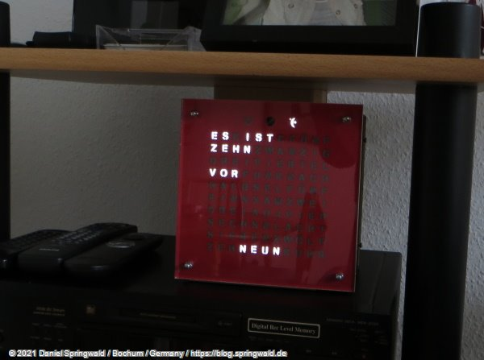
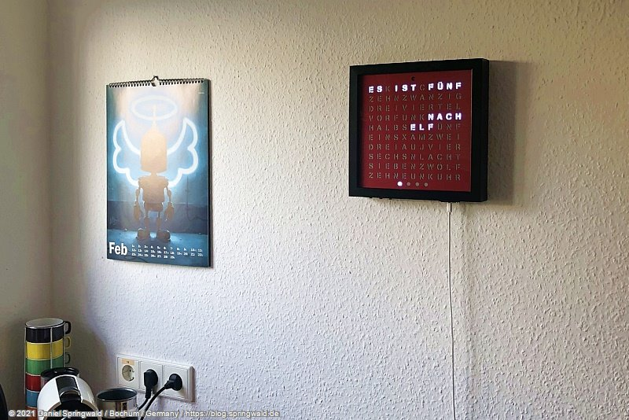

# Arduino Sketch files for Word Clock

The source code contained here is the software for a Word Clock, i.e. a clock displaying the time in words and not numbers. The clock is designed for German speaking users. For example "5:25pm" would be displayed as "ES IST FÜNF MINUTEN VOR HALB SECHS".

## First Version: Classic Clock

The first version was created during a small, private Hackathon in 2012. Details can be found in Daniel Springwald's blog: [Part 1](https://blog.springwald.de/post/2012/Hackathon-2012-Projekt-Wortwecker-Teil-1), [Part 2](https://blog.springwald.de/post/2012/Hackathon-2012-Projekt-Wortwecker-Teil-2) and [final assembly](https://blog.springwald.de/post/2014/Der-WortWecker-ist-fertig).

The first version is based on normal, white LEDs and shift registers are used to control the large number of LEDs from the Arduino. This design is quite cheap but requires a vast amount of soldering and wiring work.

The source code and other material for this clock can be found in the directory [classic-clock](classic-clock).

## Second Version: Neopixel-Based Clock

Due to several limitations of the first version, we developed a second version that uses Neopixel stripes for the illumination of the letters.

The design allows for placing the whole clock into a cheap IKEA picture frame. Details and assembly instructions can be found [here](https://blog.springwald.de/post/2020/Wortwecker-2_0).

The source code and other material for this clock can be found in the directory [neopixel-clock](neopixel-clock).

---

As the software makes only sense if you have the same hardware, it may be of limited interest for you. The circuit design may be published here in the future.

Nevertheless, you can freely use this software if you want.
