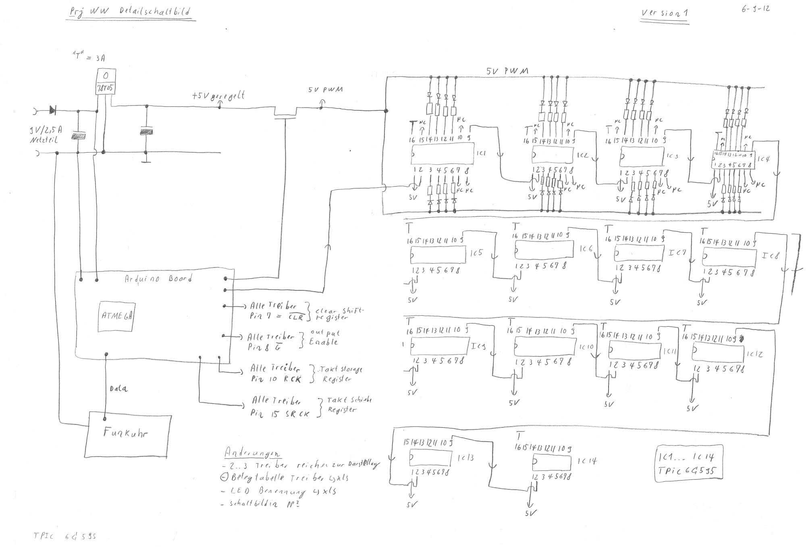

# Material for the Classic Clock

  * [drawings](drawings/): Corel Draw files to cut the different part of the clock with a laser cutter
  * [src](src/): Arduino Sketch files for the clock
  * [util](util/): C sources to create a font for the clock

The schematics of the clock:

"Layout" of the main board:

